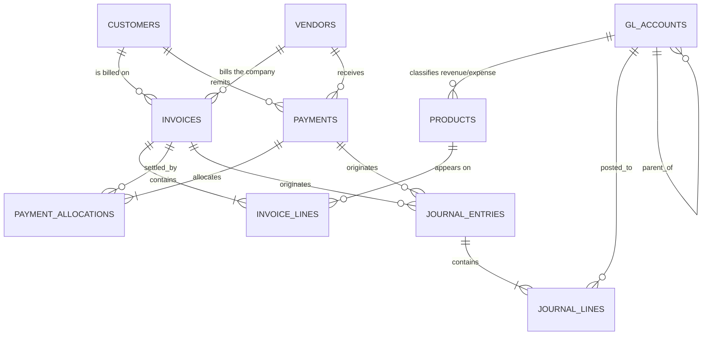

# Northstar Dynamics fictional ERP

This repository contains a deterministic SQLite ERP dataset for **Northstar
Dynamics**, a fictional international technology and services company. It
includes a normalized schema, synthetic operational data, integrity validation,
and a reusable SQL analytics pack.

## Delivered data

| Entity | Rows |
|---|---:|
| Customers | 1,000 |
| Vendors | 500 |
| GL accounts | 50 |
| Invoices | 20,000 |
| Payments | 10,000 |
| Journal entries | 5,000 |

The database also contains 100 products plus invoice lines, payment allocations,
and balanced journal lines. The generated database is
`data/fictional_erp.sqlite`. All names and transactions are fictional.

## Reproduce and verify

Only Python 3 and SQLite are required; there are no third-party dependencies.

```bash
python3 generate_erp.py
python3 validate_erp.py
python3 run_analytics.py
python3 -m unittest discover -s tests -v
```

Generation is deterministic with seed `20260729`. Use `--seed` or the count
options shown by `python3 generate_erp.py --help` to create another scenario.
The generator recreates its target database.

## Data model and relationships



### Master data

- `customers` is the accounts-receivable party master. One customer can have
  many sales invoices and receipts. Its region, currency, credit limit, terms,
  and status support customer and collections analysis.
- `vendors` is the accounts-payable party master. One vendor can have many
  purchase invoices and disbursements.
- `gl_accounts` is a 50-account chart of accounts. `parent_account_id` is a
  self-reference for account rollups. The account type and normal balance
  distinguish assets, liabilities, equity, revenue, and expenses.
- `products` maps each offering to one revenue account and one expense account.
  An invoice line may reference a product; procurement lines can instead be
  free-form expenses.

### Order-to-cash and procure-to-pay

- `invoices` uses one table for sales and purchase documents. A constraint
  enforces exactly one party: a sales invoice has a customer, while a purchase
  invoice has a vendor. Dates, terms, statuses, tax, transaction currency, and
  USD functional value are stored at header level.
- `invoice_lines` is the one-to-many detail of an invoice. The unique
  `(invoice_id, line_number)` key preserves line order. Every line is assigned
  a GL account, and line amounts reconcile to the invoice subtotal.
- `payments` similarly represents customer receipts and vendor disbursements.
  Each payment has one corresponding customer or vendor. It records both
  transaction-currency and USD functional amounts.
- `payment_allocations` is the bridge between payments and invoices, allowing
  the normal many-to-many relationship. In this generated scenario each
  payment is allocated to one invoice, but the schema supports split payments.
  The validator enforces matching party, transaction type, and currency.
- `v_invoice_balances` calculates paid and outstanding amounts using only
  cleared payments. Pending and failed payments remain visible operationally
  without reducing the accounting balance.

### General ledger

- `journal_entries` is the journal header. Optional foreign keys connect a
  journal to its source invoice or payment; manual and payroll journals have no
  source transaction. The constraint prevents a journal from referencing both.
- `journal_lines` contains the debit and credit postings. Each line belongs to
  one entry and one GL account. Every generated entry has at least two lines
  and total debits equal total credits.
- `v_trial_balance` rolls posted journal lines up by account. Draft and reversed
  entries are excluded. Journal values are in the USD functional currency.

The source links are intentionally optional because the requested 5,000
journals are a representative ledger subset, not a complete posting for all
30,000 operational transactions.

## Currency treatment

Invoices and payments preserve transaction currency and a simulated exchange
rate to USD. Their functional amounts are suitable for company-wide analysis.
Transaction amounts must not be summed across currencies; the analytics either
groups them by currency or uses the USD functional columns. Journal lines are
stored in functional cents.

## Analytics

`analytics/erp_analytics.sql` contains eight executable analyses:

1. invoice portfolio, outstanding balances, and paid percentage by currency;
2. sales by customer region;
3. vendor spend by category;
4. accounts-receivable aging as of 2026-01-31;
5. payment volume by type, status, and method;
6. monthly sales and purchase trends;
7. the posted USD trial balance; and
8. collections and payment risk indicators.

`run_analytics.py` executes all named queries and writes
`analytics/analytics_report.md`. The report is the performed analysis for the
committed dataset; rerun it after regenerating the database.

## Integrity controls

`validate_erp.py` verifies exact requested counts, foreign keys, invoice
line-to-header reconciliation, party/type/currency consistency, full payment
allocation, absence of cleared overpayments, invoice status logic, positive
functional values, minimum journal detail, and balanced debits and credits.
The integration test creates and validates a smaller database through the same
command-line interfaces.

This is synthetic demonstration data, not a production accounting system.
Exchange rates are simulated, tax rules are simplified, and personally
identifiable or real-company information is not used.
